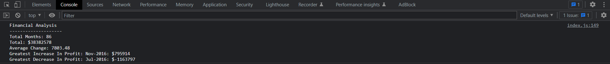

# Module 4 Assignment

# Building a Financial Report Using JavaScript

## Description:

I built this project to display the financial statistics of a company's earnings using the skills I have learnt in JS.

The analysis shows the greatest increases in profits and losses as well as the average change earned.

## Deployed Link:

## License 

Copyright (c). All rights reserved.

Licensed under the MIT license.